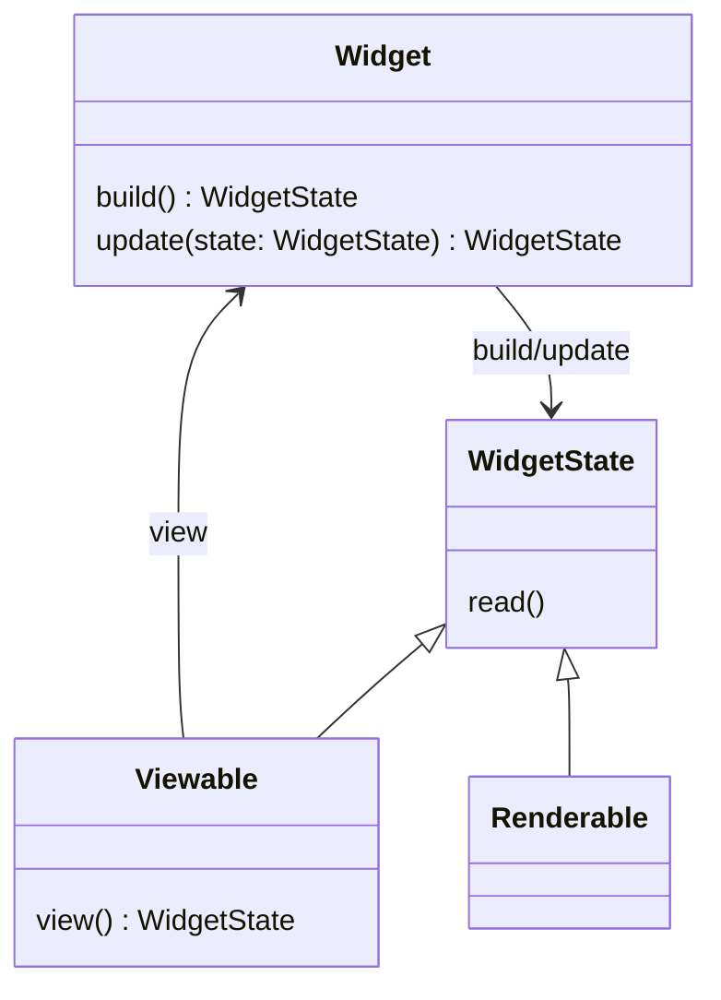
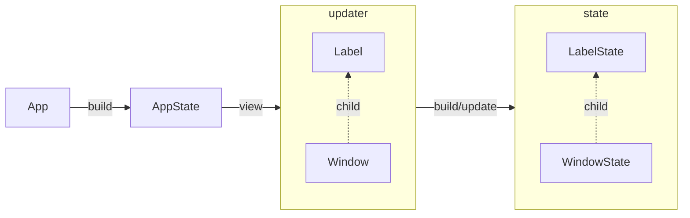

# Owlkettle
*Freshly brewed user interfaces.*

Owlkettle is a declarative user interface framework based on GTK.
It is written in Nim.

Here is an example for a simple counter app. When you click on the "+" Button, the counter increments.

```nim
import owlkettle

viewable App:
  counter: int

method view(app: AppState): Widget =
  result = gui:
    Window:
      title = "Counter"
      default_size = (200, 60)
      
      Box(orient = OrientX, margin = 12, spacing = 6):
        Label(text = $app.counter)
        Button {.expand: false.}:
          text = "+"
          style = {ButtonSuggested}
          proc clicked() =
            app.counter += 1

brew(gui(App()))
```

The code above will result in the following application:


Owlkettle also supports building libadwaita apps.
To enable libadwaita, import `owlkettle/adw` and change the last line to `adw.brew(gui(App()))`.


## Installation

Owlkettle requires GTK 4 to be installed on your system.
You can install it by running `dnf install gtk4-devel libadwaita-devel` on Fedora or `apt install libgtk-4-dev libadwaita-1-dev` on Ubuntu.

```bash
$ nimble install owlkettle
```

## Tutorial

Let's build a simple Todo app using owlkettle.
The source code for this example can be found [here](examples/todo.nim).
Here is what it will look like when it is done.


First we model the application state.
In this case we need to store a list of todo items (`todos`) where each item has a text and can be marked as done.
We also store the current value of the entry.

```nim
type TodoItem = object
  text: string
  done: bool

viewable App:
  todos: seq[TodoItem]
  new_item: string
```

Next we need to define the `view` method of the application.
For now, an empty window with the title "Todo" is created.

```nim
method view(app: AppState): Widget =
  result = gui:
    Window:
      title = "Todo"
```

To make development easier, we initialize the app with two placeholder todo items.

```nim
brew(gui(App(todos = @[
  TodoItem(text: "First Item", done: true),
  TodoItem(text: "Second Item")
])))
```

Here is what our application looks like currently:


Let's show the placeholder todo items in a list.
We use a `ListBox` which contains a `Label` for each item.
A `ScrolledWindow` is used to add a scrollbar to the `ListBox`.

When defining GUIs, we can use structured control flow constructs such as `for` loops and `if` statements.
In this case a `for` loop is used to create a label for each item.
When `app.todos` changes, the GUI is updated automatically.

```nim
Window:
  title = "Todo"
  
  Box(orient = OrientY, spacing = 6, margin = 12):
    Frame:
      ScrolledWindow:
        ListBox:
          selection_mode = SelectionNone
          for it, todo in app.todos:
            Label:
              text = todo.text
              x_align = 0
```


In order to allow the user to mark items as done, we add a `CheckButton` next to each label.
The `changed` event handler is called when the user toggles the `CheckButton`.
In this case, we update the current state of the `TodoItem`.

```diff
 ...
 ListBox:
   selection_mode = SelectionNone
   for it, todo in app.todos:
+    Box:
+      spacing = 6
+      CheckButton {.expand: false.}:
+        state = todo.done
+        proc changed(state: bool) =
+          app.todos[it].done = state
       Label:
         text = todo.text
         x_align = 0
```


Next, we add an entry which allows the user to add new items to the todo list.
The `expand` attribute of the `Box` which contains the entry and button is set to `false` in order to prevent the `Box` from growing to take up remaining space in the parent widget.

```nim
Window:
  ...
  Box(orient = OrientY, spacing = 6, margin = 12):
    Box(orient = OrientX, spacing = 6) {.expand: false.}:
      Entry:
        text = app.new_item
        proc changed(new_item: string) =
          app.new_item = new_item
      Button {.expand: false.}:
        icon = "list-add-symbolic"
        style = {ButtonSuggested}
        proc clicked() =
          app.todos.add(TodoItem(text: app.new_item))
          app.new_item = ""
    
    Frame:
      ScrolledWindow:
        ...
```


Finally we add a `HeaderBar` and a menu which contains a button used to delete all checked items.

```nim
Window:
  ...
  HeaderBar {.add_titlebar.}:  
    MenuButton {.add_right.}:
      icon = "open-menu-symbolic"
      Popover:
        Box(orient=OrientY, spacing=6, margin=6):
          Button:
            icon = "user-trash-symbolic"
            style = {ButtonDestructive}
            proc clicked() =
              app.todos = app.todos.filter_it(not it.done)
  Box:
    ...
```

Clicking on the `MenuButton` opens the menu.


The source code for this example can be found [here](examples/todo.nim).

### Owlkettle Internals

Every widget in owlkettle is either a renderable or a viewable widget.
Renderable widgets provide declarative interfaces to GTK widgets.
For example `Button`, `Window` and `Entry` are renderable widgets.
Viewable widgets are abstractions over renderable widgets.
Owlkettle applications are usually implemented as viewable widgets.



Every widget has a state (`WidgetState`) and an updater object (`Widget`).
The updater is used to update the internal widget state.
It records which fields of the state the parent widget wants to set and which values these fields should be set to.
This allows owlkettle to preserve the rest of widget's state.

Every viewable widget has a `view` method which returns the updaters for its child widget states.
Viewable widgets are expanded using `view` until a renderable widget is reached.




## Documentation

You can find a reference of all widgets in [docs/widgets.md](docs/widgets.md).

If you want to cross compile checkout [docs/cross_compiling.md](docs/cross_compiling.md).

Additional examples can be found in the [examples](examples) folder.

A guide for migrating from owlkettle 1.x.x to 2.0.0 [is available here](docs/migrating_1_to_2.md).

## License

Owlkettle is licensed under the MIT license.
See `LICENSE.txt` for more information.
