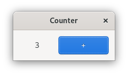
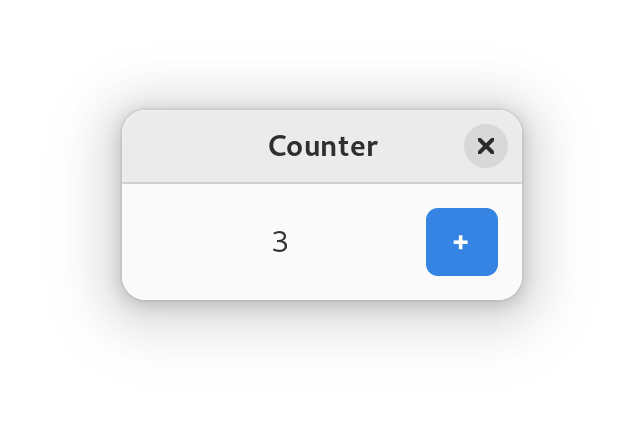

# Owlkettle
*Freshly brewed user interfaces.*

Owlkettle is a declarative user interface framework based on GTK.
It is written in Nim.

Here is an example for a simple counter app. When you click on the "+" Button, the counter increments.

```nim
import owlkettle

viewable App:
  counter: int

method view(app: AppState): Widget =
  result = gui:
    Window:
      title = "Counter"
      defaultSize = (200, 60)

      Box(orient = OrientX, margin = 12, spacing = 6):
        Label(text = $app.counter)
        Button {.expand: false.}:
          text = "+"
          style = [ButtonSuggested]
          proc clicked() =
            app.counter += 1

brew(gui(App()))
```

The code above will result in the following application:



Owlkettle also supports building libadwaita apps.
To enable libadwaita, import `owlkettle/adw` and change the last line to `adw.brew(gui(App()))`.



## Installation

Owlkettle requires GTK 4 to be installed on your system.
You can install it by running `dnf install gtk4-devel libadwaita-devel` on Fedora, `apt install libgtk-4-dev libadwaita-1-dev` on Ubuntu or `pacman -S mingw-w64-x86_64-gtk4 mingw-w64-x86_64-libadwaita` on Windows' Msys.

```bash
$ nimble install owlkettle@#head
```

Check out [the installation guide](https://can-lehmann.github.io/owlkettle/docs/installation.html) for further instructions.

## Documentation

You can find a reference of all widgets in [docs/widgets.md](https://github.com/can-lehmann/owlkettle/blob/main/docs/widgets.md).

A tutorial for building a simple Todo application can be found [here](https://can-lehmann.github.io/owlkettle/docs/tutorial.html).

Additional examples can be found [here](https://can-lehmann.github.io/owlkettle/examples/README.html).

A reference of all supported libadwaita widgets can be found in [docs/widgets_adwaita.md](https://github.com/can-lehmann/owlkettle/blob/main/docs/widgets_adwaita.md).

<!--
If you want to cross compile checkout [docs/cross_compiling.md](docs/cross_compiling.md).

A guide for migrating from owlkettle 1.x.x to 2.0.0 [is available here](docs/migrating_1_to_2.md).
-->

## License

Owlkettle is licensed under the MIT license.
See `LICENSE.txt` for more information.
