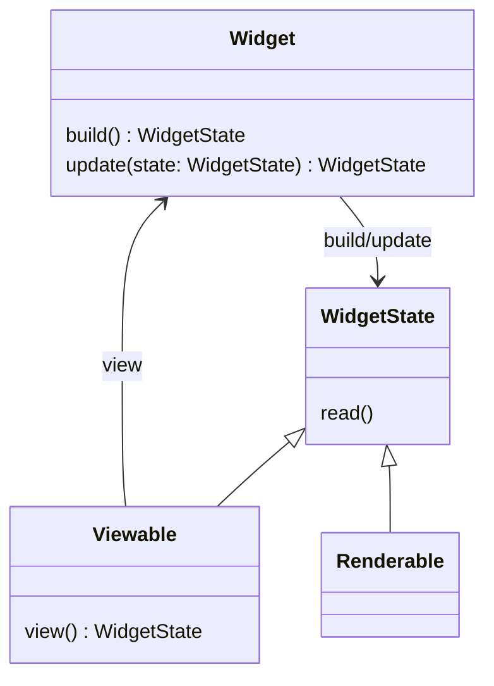
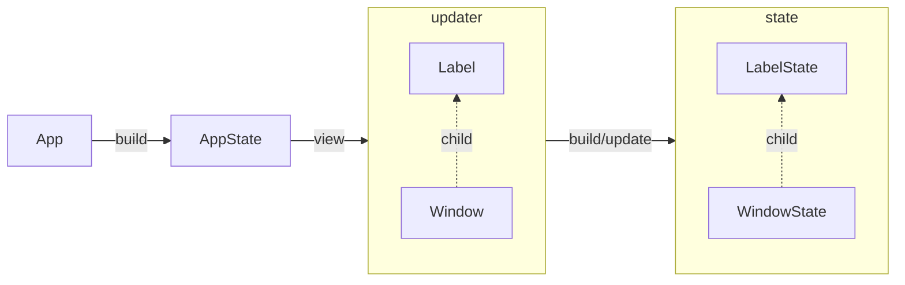

# **Owlkettle Internals**

## **Widget-Basics**

Every widget in owlkettle is either a `renderable` or a `viewable` widget.

`Renderable` widgets provide declarative interfaces to GTK widgets.
For example `Button`, `Window` and `Entry` are renderable widgets.

`Viewable` widgets are abstractions over renderable widgets.
Owlkettle applications and any custom widgets written by you are usually implemented as viewable widgets.

Regardless of that distinction, all widget consists of a `State`, which is used to generate a `Widget` instance via a `view` method.

We shall go into more detail for Viewables in the next sections.

## **Custom Widgets**
To make one, just declare the `Viewable` and the fields on its state, then write a `view` method that creates the `Widget`.

Let's look at a `CustomLabel` widget with a `text`-field that renders the text and another piece of text besides it.

```nim
import owlkettle 

### Custom Label Widget
viewable CustomLabel:
  text: string

method view*(state: CustomLabelState): Widget =
  echo state.repr
  gui:
    Box():
      Label(text = "I was passed the value: ")
      Label(text = state.text)

## The App
viewable App:
  discard

method view*(state: AppState): Widget =
  gui:
    Window:
      CustomLabel(text = "test")

when isMainModule:
  brew(gui(App()))
```

And that's your CustomLabel. Note though, that you can't write:

```nim
...
method view*(state: AppState): Widget =
  gui:
    Window:
      CustomLabel(text = "test"):
        Label(text = "Also render me!")
...
```

because CustomLabel doesn't have the ability to store or render child-Widgets!
For that we need adders!

## **Adding Widgets with Adders**
### **One Adder**
Not all Widgets have adders. But all Widgets that want to be passed other Widgets from the outside to contain (like `Box` for example) need at least one.

To do this you must:
1) Add a `seq[Widget]` field to your widget-state that can store child-Widgets
2) Define an adder that enables the `seq[Widget]` field and adds widgets to it
3) Define in your `view` method where to put the child-widgets from the widget-state

An adder is a proc that enables the field that stores `seq[Widget]` and defines how to add a child-widget to it.
It implicitly receives the parameters 1) `widget` of type `Widget` (the custom widget itself) and 2) `child` of type `Widget` (the child-widget to add).

"Enabling" a field of your custom widget means that it allows an "outside"-Widget to mutate it. In this case it allows adding `Widget`s to `seq[Widget]`. Without that, manipulating the `seq[Widget]` field is not possible. 

Note: Any field you define under `viewable` will be present on `widget` in the form of the boolean field `has<FieldName>` and `val<FieldName>`. `has<FieldName>` controls whether the field is dis/enabled. `val<FieldName>` is the actual field value. 

Let's look at an example for a `CustomBox`:
```nim
import owlkettle

## The custom widget
viewable CustomBox:
  myChildren: seq[Widget] # The seq[Widget] field

  adder add: # Define the default adder `add`
    widget.hasMyChildren = true # Enables mutating `myChildren`
    widget.valMyChildren.add(child) # Adds the child-Widget to `myChildren`

method view(state: CustomBoxState): Widget =
  gui: 
    Box(orient = OrientY):
      for child in state.myChildren:
        insert child # Inserts child-widget into this CustomBox-widget

## The App
viewable App:
  discard

method view(state: AppState): Widget =
  gui:
    Window:
      CustomBox():
        Label(text = "I was passed in from the outside")
        Label(text = "Me too!")
        Label(text = "Me three!")

when isMainModule:
  brew(gui(App()))
```

We define `myChildren` and "enable" it in the `add` adder via `widget.hasMyChildren = true`.
Then we define how to add the `child` Widget to it, which in this case is simply us adding it to the seq.

### **Multiple Adders**
# TODO: Write this.

### **Hooks**
# TODO: Write this
### **Setters**

# TODO: Write this

What are the hasMargin and valMargin procs for, are they things we should know about?



Every widget has a state (`WidgetState`) and an updater object (`Widget`).
The updater is used to update the internal widget state.
It records which fields of the state the parent widget wants to set and which values these fields should be set to.
This allows owlkettle to preserve the rest of widget's state.

Every viewable widget has a `view` method which returns the updaters for its child widget states.
Viewable widgets are expanded using `view` until a renderable widget is reached.



