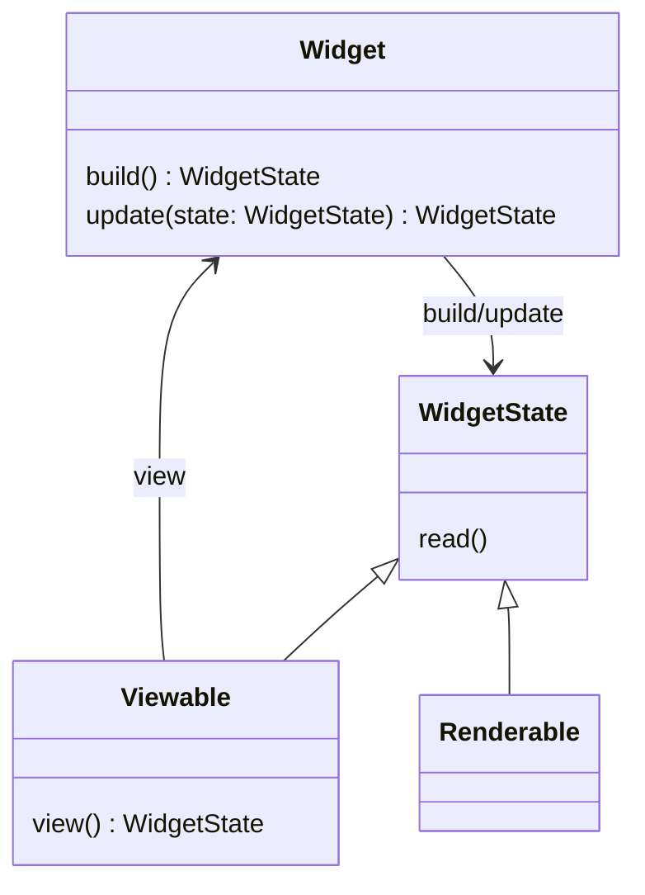
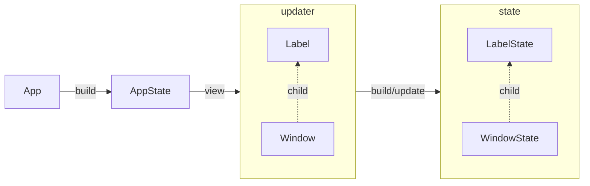

# **Owlkettle Internals**

## **Widget-Basics**

Every widget in owlkettle is either a `renderable` or a `viewable` widget.

`Renderable` widgets provide declarative interfaces to GTK widgets.
For example `Button`, `Window` and `Entry` are renderable widgets.

`Viewable` widgets are abstractions over renderable widgets.
Owlkettle applications and any custom widgets written by you are usually implemented as viewable widgets.

Regardless of that distinction, all widget consists of a `State`, which is used to generate a `Widget` instance via a `view` method.

Any field on a `State` is represented on the generated Widget via the fields `has<Field>` and `val<Field>`.

We shall go into more detail for Viewables in the next sections.

## **Custom Widgets**
To make one, just declare the `Viewable` and the fields on its state, then write a `view` method that creates the `Widget`.

Let's look at a `CustomLabel` widget with a `text`-field that renders the text and another piece of text besides it.

```nim
import owlkettle 

### Custom Label Widget
viewable CustomLabel:
  text: string

method view*(state: CustomLabelState): Widget =
  echo state.repr
  gui:
    Box():
      Label(text = "I was passed the value: ")
      Label(text = state.text)

## The App
viewable App:
  discard

method view*(state: AppState): Widget =
  gui:
    Window:
      CustomLabel(text = "test")

when isMainModule:
  brew(gui(App()))
```

And that's your CustomLabel. Note though, that you can't write:

```nim
...
method view*(state: AppState): Widget =
  gui:
    Window:
      CustomLabel(text = "test"):
        Label(text = "Also render me!")
...
```

because CustomLabel doesn't have the ability to store or render child-Widgets!
For that we need adders!

## **Adding Widgets with Adders**
### **One Adder**
Not all Widgets have adders. But all Widgets that want to be passed other Widgets from the outside to contain (like `Box` for example) need at least one.

To do this you must:
1) Add a field to your widget-state that can store child-Widgets (e.g. one with type `seq[Widget]`)
2) Define an adder that enables the child-widget-field and adds a given widget to it
3) Define in your `view` method where to put the child-widgets from the widget-state

An adder is a proc that enables the field that stores child-widgets and defines how to add widgets to that field.
It implicitly receives the parameters 1) `widget` of type `Widget` (the custom widget itself) and 2) `child` of type `Widget` (the child-widget to add).

"Enabling" a field of your custom widget means that it allows an "outside"-Widget to mutate it. In this case it allows adding `Widget`s to the child-widget-field. Without that, manipulating the child-widget-field field is not possible. 

Note: Any field you define under `viewable` will be present on `widget` in the form of the boolean field `has<FieldName>` and `val<FieldName>`. `has<FieldName>` controls whether the field is dis/enabled. `val<FieldName>` is the actual field value. 

Let's look at an example for a `CustomBox`:

```nim
import owlkettle

## The custom widget
viewable CustomBox:
  myChildren: seq[Widget] # The child-widget field

  adder add: # Define the default adder `add`
    widget.hasMyChildren = true # Enables mutating `myChildren`
    widget.valMyChildren.add(child) # Adds the child-Widget to `myChildren`

method view(state: CustomBoxState): Widget =
  gui: 
    Box(orient = OrientY):
      for child in state.myChildren:
        insert child # Inserts child-widget into this CustomBox-widget

## The App
viewable App:
  discard

method view(state: AppState): Widget =
  gui:
    Window:
      CustomBox():
        Label(text = "I was passed in from the outside")
        Label(text = "Me too!")
        Label(text = "Me three!")

when isMainModule:
  brew(gui(App()))
```

We define `myChildren` and "enable" it in the `add` adder via `widget.hasMyChildren = true`.
Then we define how to add the `child` Widget to it, which in this case is simply us adding it to the seq.

But what if we want to store child-widgets in a table-field on `CustomBox` ? We would need to pass the key to store the child-widget under to the adder...
### **Adders with properties**
Let's make a custom widget that stores Widgets in a `Table[string, Widget]` and displays the widget next to the key it was stored with.

First we need to modify our adder, telling it that there will be additional parameters. 

```nim
...
viewable CustomBox:
  myChildren: Table[string, Widget] # The child-widget field

  adder add {.key: none(string).}: 
...
``` 

Additional parameters passed to adders like that are called "properties". Properties **must** have a default value, their type is inferred based on that value. If you do not want to provide a default value, you can use an `Option` type.

Let's assert that anyone using `CustomBox` also passes a key and doesn't accidentally reuse a key that has already been used to store a Widget that in the table:

```nim
viewable CustomBox:
  myChildren: Table[string, Widget] # The child-widget field

  adder add {.key: none(string).}: 
    assert key.isSome(), "CustomBox requires you to tell it under which key to store child widgets. Add a 'key' property"
    
    let keyIsFree = not widget.valMyChildren.hasKey(key.get()) 
    assert keyIsFree, fmt"A widget with the key '{key.get()} has already been added to CustomBox. Use a different name"

    widget.hasMyChildren = true 
    widget.valMyChildren[key.get()] = child

method view(state: CustomBoxState): Widget =
  gui: 
    Box(orient = OrientY):
      for key in state.myChildren.keys:
        Box():
          Label(text = key)
          insert state.myChildren[key]

## The App
viewable App:
  discard

method view(state: AppState): Widget =
  gui:
    Window:
      CustomBox():
        Label(text = "I was passed in from the outside") {.key: some("key1").}
        Label(text = "Me too!") {.key: some("key2").}
        Label(text = "Me three!") {.key: some("key3").}
        # Label(text = "Me four!") {.key: some("key3").} # Will cause a runtime error because key3 is already in use

when isMainModule:
  brew(gui(App()))
```

If we were to remove the "#" in front of the last Label, we would be facing a runtime error produced by the application, since "key3" was already used.

Note: When using optionals, due to the macros involved, you can only use the `some(<value>)`/`none(<typedesc>)` syntax.

### **Multiple Adders**
In addition to passing properties to an adder, you can naturally also have multiple different adders. They just need different names.

Let's look at a `CustomBox` widget with 2 `seq[Widget]` fields that you add to with different adders:

```nim
import owlkettle

viewable CustomBox:
  myChildren1: seq[Widget]
  myChildren2: seq[Widget]

  adder add: 
    widget.hasMyChildren1 = true 
    widget.valMyChildren1.add child
  
  adder add2:
    widget.hasMyChildren2 = true
    widget.valMyChildren2.add child

method view(state: CustomBoxState): Widget =
  gui: 
    Box(orient = OrientY):
      Box():
        Label(text = "First Box")
        for widget in state.myChildren1:
          insert widget
        
      Box():
        Label(text = "Second Box")
        for widget in state.myChildren2:
          insert widget

## The App
viewable App:
  discard

method view(state: AppState): Widget =
  gui:
    Window:
      CustomBox():
        Label(text = "I was passed in from the outside") # Uses "add"-adder implicitly by default 
        Label(text = "Me too!") {.add.} # Uses "add"-adder explicitly
        Label(text = "Me three!") {.add2.} # Uses "add2"-adder explicitly

when isMainModule:
  brew(gui(App()))
```

If no adder is specified, `Widget`s will always be added using the `add` adder. Otherwise the adder defined by the pragma annotation will be used.

### **Hooks**

Hooks are a concept introduced by owlkettle that allows you to execute code throughout a widget's lifecycle, or when an action on one of its fields occurs.

Most hooks are defined only for Widgets, some are defined for both and `property` is only available as a hook for fields.

The available hooks are:
  - (W) beforeBuild     : Executed only once before the `WidgetState` is created.
  - (WF) build           : Executed once after `WidgetState` is instantiated from `Widget`. Default values have not yet been applied and will overwrite any values set within this hook.
  - (W) afterBuild      : Executed only once after the `WidgetState` was created. Is executed *after* all default values have been applied.
  - (W) connectEvents   : Only relevant for renderables. Executed every time a callback is supposed to be attached to the underlying GTK widget. It defines how to do so.
  - (W) disconnectEvents: Only relevant for renderables. Executed every time a callback is supposed to be removed from the underlying GTK widget. It defines how to do so.
  - (WF) update         : Executed every time `WidgetState` is updated by `Widget`.
  - (F) property        : Executed every time the hook-field changed its value in both the update and build phases.
  - (F) read            : Used in `Dialog`. Executes every time the state of the underlying GTK-Widget changes.

W: Can act as hook for Widgets
F: Can act as hook for fields

All hooks have implicit access to a variable called `state`, which contains the `WidgetState`-instance of your particular widget.

With the exception of `read`, all hooks also have implicit access to a variable called `widget`, which is the `Widget` instance.

Generally the `build` and `update` hook are likely to have the highest utility for you. Consult their individual sections for more information.

#### Build Hook
The `build` hook runs once just before any values are assigned to the `WidgetState`.

The intended usecase for build-hooks is adding logic that sets fields on `WidgetState` that don't have default-values.

Example: A Widget may need to load data from elsewhere, via a file or HTTP request. Doing this in the `view` method would rerun the code every time the widget re-renders. But in the build-hook, it only runs once during widget-creation. 

Here a simple code-example:

```nim
# example.json
{"name":"example"}

# main.nim
import std/json
import owlkettle
import owlkettle/gtk

type Config = object
  name: string

viewable App:
  config: Config

  hooks:
    build:
      state.config = "./src/example.json".readFile().parseJson().to(Config)

method view(state: AppState): Widget =
  result = gui:
    Window:
      Label:
        text = state.config.name

brew(gui(App()))
```


`build` hooks also are inherited from the parent-widget. In those scenarios, during the build-phase owlkettle will first execute the `build` hook of the parent and then the `build` hook of the child.

To demonstrate this, here a small example:

```nim
import owlkettle

viewable Parent:
  hooks:
    build:
      echo "Parent.build"
    beforeBuild:
      echo "Parent.beforeBuild"
    afterBuild:
      echo "Parent.afterBuild"

method view(state: ParentState): Widget =
  gui:
    Label(text="Parent")

viewable Child of Parent:
  hooks:
    build:
      echo "Child.build"
    beforeBuild:
      echo "Child.beforeBuild"
    afterBuild:
      echo "Child.afterBuild"

method view(state: ChildState): Widget =
  gui:
    Label(text="Child")

viewable App:
  discard

method view(app: AppState): Widget =
  result = gui:
    Window:
      Child()

brew(gui(App()))
```
This will print:
```txt
Child.beforeBuild
Parent.build
Child.build
Child.afterBuild
```

This makes sense, as only the purpose of the `build` hook (handling instantiating data not provided elsewhere) is also useful for any child-widgets.

Given that the purpose of `beforeBuild` is to handle instantiating renderables and `afterBuild` is about doing any extra handling of transforming of data given to the widget, both of which are very specific for their respective widget, it makes sense that they are "overwritten" instead of inherited.

For more info on the purpose of `beforeBuild` and `afterBuild` hooks, consult their respective sections in this file.

#### Before-Build Hook
The `beforeBuild` hook runs once before the build-hook and thus also before any values are assigned to the `WidgetState`.

Their main usecase is renderables, where they are used to instantiate the GTK-Widget and assign it to `internalWidget` on `WidgetState`.

It should be noted that unlike `build` hooks, `beforeBuild` hooks are not inherited by any child-widget. For more information, see the `build` hooks section.

Here a simple code-example for writing a `beforeBuild` hook:

```nim
import owlkettle
import owlkettle/gtk
import std/json

renderable MyRenderable:
  text: string
    
  hooks:
    beforeBuild:
      echo state.repr
      state.internalWidget = gtk_label_new("ExampleText")

viewable App:
  discard

method view(app: AppState): Widget =
  result = gui:
    Window:
      MyRenderable()

brew(gui(App()))
```

We set the label-text to render directly via the `gtk_label_new` proc.
But what if we want to have a parent widget decide the text to render once and then never update it again?  

That leads us to what `afterBuild` hooks are...

#### After-Build Hook
The `afterBuild`-hook runs after initial values (default-values, values passed in by other components during instantiation) have been assigned to the `WidgetState`.

They are useful if any processing on the initial data that is passed in must happen. Example are validating data, inferring data from passed in data, or fetching other data based on what was passed in.

It should be noted that unlike `build` hooks, `afterBuild` hooks are not inherited by any child-widget. For more information, see the `build` hooks section.

For a technical example, here a widget that infers the value of an "inital" number based on an enum that gets passed in:

```nim
import owlkettle
import std/tables

type MyEnum = enum
  A, B, C, D

viewable MyViewable:
  table: Table[MyEnum, int] = {A: 5, B: 2, C: 50, D: 600}.toTable()
  key: MyEnum
  initialValue: int

  hooks:
    afterBuild:
      state.initialValue = state.table[state.key]


method view(state: MyViewableState): Widget =
  result = gui:
    Label:
      text = $state.initialValue

viewable App:
  discard

method view(app: AppState): Widget =
  result = gui:
    Window:
      MyViewable(key = C)

brew(gui(App()))
```

#### ConnectEvents/DisconnectEvents Hook

The `connectEvents` hook runs during the build-phase as well as during every update-phase after the `disconnectEvents` hook. The `disconnectEvents` hook meanwhile only runs during the update phase. 

These hooks are only relevant for renderables, as their task is to attach/detach event-listeners stored in `WidgetState` to/from the underlying GTK-widget. 

Here a minimal example of a custom button widget that connects an event-listener proc to the gtk click event and disconnects it on update:

```nim
import owlkettle
import std/tables
import owlkettle/[widgetutils, gtk]

renderable MyButton of BaseWidget:  
  proc clicked()
  
  hooks:
    beforeBuild:
      state.internalWidget = gtk_button_new()

    connectEvents:
      echo "Connect"
      state.connect(state.clicked, "clicked", eventCallback)
    
    disconnectEvents:
      echo "Disconnect"
      state.internalWidget.disconnect(state.clicked)

viewable App:
  discard

method view(app: AppState): Widget =
  result = gui:
    Window:
      MyButton():
        proc clicked() = echo "Potato"

brew(gui(App()))
```

#### Update Hook
# TODO: Write this

#### Property Hook
# TODO: Write this

#### Read Hook
# TODO: Write this

### **Custom CSS**

# TODO: Write this




Every widget has a state (`WidgetState`) and an updater object (`Widget`).
The updater is used to update the internal widget state.
It records which fields of the state the parent widget wants to set and which values these fields should be set to.
This allows owlkettle to preserve the rest of widget's state.

Every viewable widget has a `view` method which returns the updaters for its child widget states.
Viewable widgets are expanded using `view` until a renderable widget is reached.



