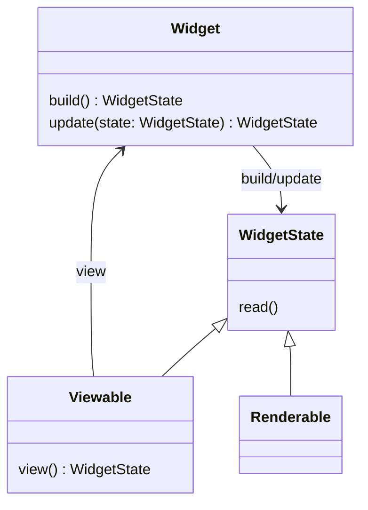
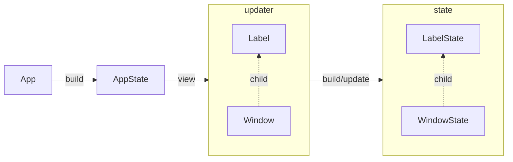

# Owlkettle Internals

Every widget in owlkettle is either a renderable or a viewable widget.
Renderable widgets provide declarative interfaces to GTK widgets.
For example `Button`, `Window` and `Entry` are renderable widgets.
Viewable widgets are abstractions over renderable widgets.
Owlkettle applications are usually implemented as viewable widgets.

Every widget has a state (`WidgetState`) and an updater object (`Widget`).
The updater is used to update the internal widget state.
It records which fields of the state the parent widget wants to set and which values these fields should be set to.
This allows owlkettle to preserve the rest of widget's state.

Every viewable widget has a `view` method which returns the updaters for its child widget states.
Viewable widgets are expanded using `view` until a renderable widget is reached.

