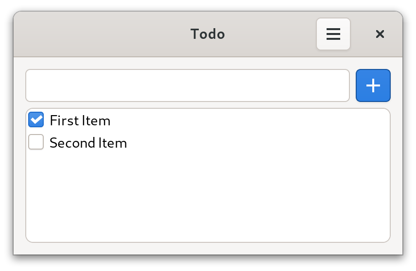
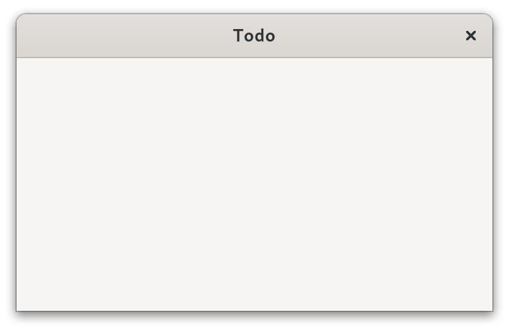
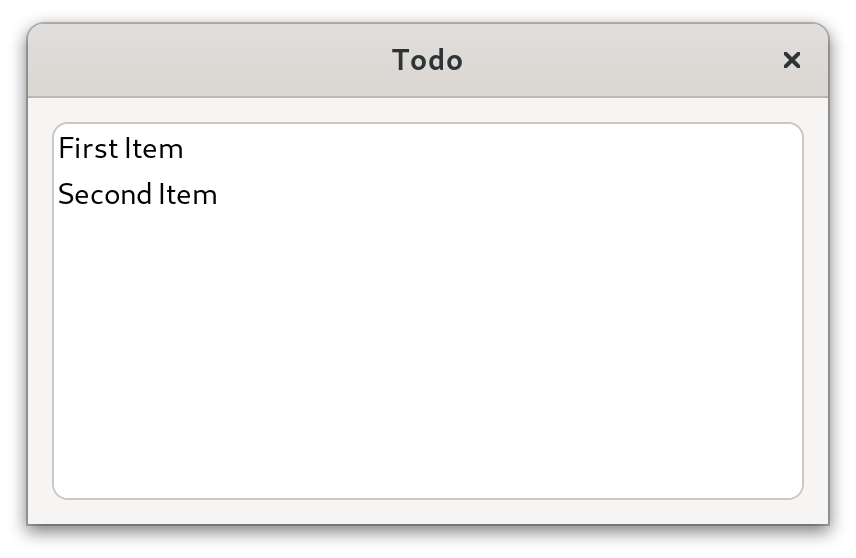
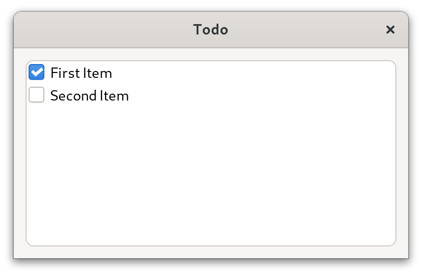
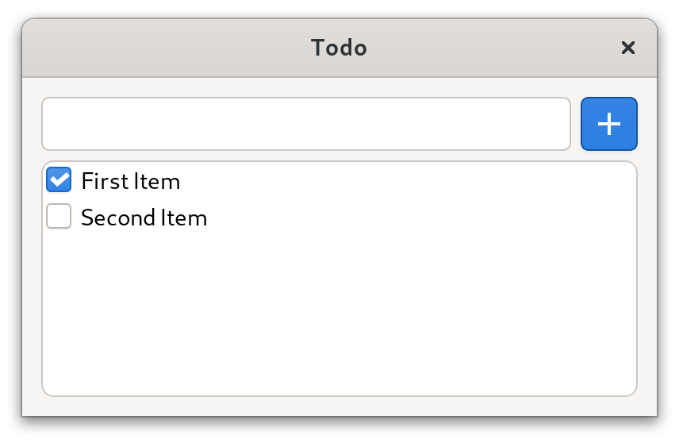

# Tutorial

Let's build a simple Todo app using owlkettle.
The source code for this example can be found [here](https://github.com/can-lehmann/owlkettle/blob/main/examples/apps/todo.nim).
Here is what it will look like when it is done.



First we model the application state.
In this case we need to store a list of todo items (`todos`) where each item has a text and can be marked as done.
We also store the current value of the entry.

```nim
type TodoItem = object
  text: string
  done: bool

viewable App:
  todos: seq[TodoItem]
  new_item: string
```

Next we need to define the `view` method of the application.
For now, an empty window with the title "Todo" is created.

```nim
method view(app: AppState): Widget =
  result = gui:
    Window:
      title = "Todo"
```

To make development easier, we initialize the app with two placeholder todo items.

```nim
brew(gui(App(todos = @[
  TodoItem(text: "First Item", done: true),
  TodoItem(text: "Second Item")
])))
```

Here is what our application looks like currently:



Let's show the placeholder todo items in a list.
We use a `ListBox` which contains a `Label` for each item.
A `ScrolledWindow` is used to add a scrollbar to the `ListBox`.

When defining GUIs, we can use structured control flow constructs such as `for` loops and `if` statements.
In this case a `for` loop is used to create a label for each item.
When `app.todos` changes, the GUI is updated automatically.

```nim
Window:
  title = "Todo"
  
  Box(orient = OrientY, spacing = 6, margin = 12):
    Frame:
      ScrolledWindow:
        ListBox:
          selection_mode = SelectionNone
          for it, todo in app.todos:
            Label:
              text = todo.text
              x_align = 0
```



In order to allow the user to mark items as done, we add a `CheckButton` next to each label.
The `changed` event handler is called when the user toggles the `CheckButton`.
In this case, we update the current state of the `TodoItem`.

```diff
 ...
 ListBox:
   selection_mode = SelectionNone
   for it, todo in app.todos:
+    Box:
+      spacing = 6
+      CheckButton {.expand: false.}:
+        state = todo.done
+        proc changed(state: bool) =
+          app.todos[it].done = state
       Label:
         text = todo.text
         x_align = 0
```



Next, we add an entry which allows the user to add new items to the todo list.
The `expand` attribute of the `Box` which contains the entry and button is set to `false` in order to prevent the `Box` from growing to take up remaining space in the parent widget.

```nim
Window:
  ...
  Box(orient = OrientY, spacing = 6, margin = 12):
    Box(orient = OrientX, spacing = 6) {.expand: false.}:
      Entry:
        text = app.new_item
        proc changed(new_item: string) =
          app.new_item = new_item
      Button {.expand: false.}:
        icon = "list-add-symbolic"
        style = [ButtonSuggested]
        proc clicked() =
          app.todos.add(TodoItem(text: app.new_item))
          app.new_item = ""
    
    Frame:
      ScrolledWindow:
        ...
```



Finally we add a `HeaderBar` and a menu which contains a button used to delete all checked items.

```nim
Window:
  ...
  HeaderBar {.add_titlebar.}:  
    MenuButton {.add_right.}:
      icon = "open-menu-symbolic"
      Popover:
        Box(orient=OrientY, spacing=6, margin=6):
          Button:
            icon = "user-trash-symbolic"
            style = [ButtonDestructive]
            proc clicked() =
              app.todos = app.todos.filter_it(not it.done)
  Box:
    ...
```

Clicking on the `MenuButton` opens the menu.


The source code for this example can be found [here](https://github.com/can-lehmann/owlkettle/blob/main/examples/apps/todo.nim).

## Next Steps

- Improve the Todo App
  - Add an option to hide completed items
  - Replace the "Delete" button with a `ModelButton` and create a simple menu structure.
    Check out [the popover_menu example](https://github.com/can-lehmann/owlkettle/blob/main/examples/widgets/popover_menu.nim) for how to create a simple menu structure.
  - Use `owlkettle/adw` to convert the Todo app to a libadwaita application.
  - Save and load todos from a file
- Check out the other [examples](https://github.com/can-lehmann/owlkettle/blob/main/examples)
- Start working on your own projects! You might find the following links useful:
  - Here is a list of [examples](https://github.com/can-lehmann/owlkettle/blob/main/examples)
  - [widgets.md](https://github.com/can-lehmann/owlkettle/blob/main/docs/widgets.md) is a reference of all owlkettle widgets
  - [widgets_adwaita.md](https://github.com/can-lehmann/owlkettle/blob/main/docs/widgets_adwaita.md) is a reference of all libadwaita widgets supported by owlkettle


