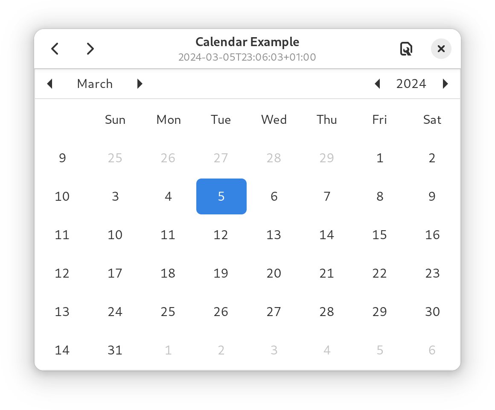
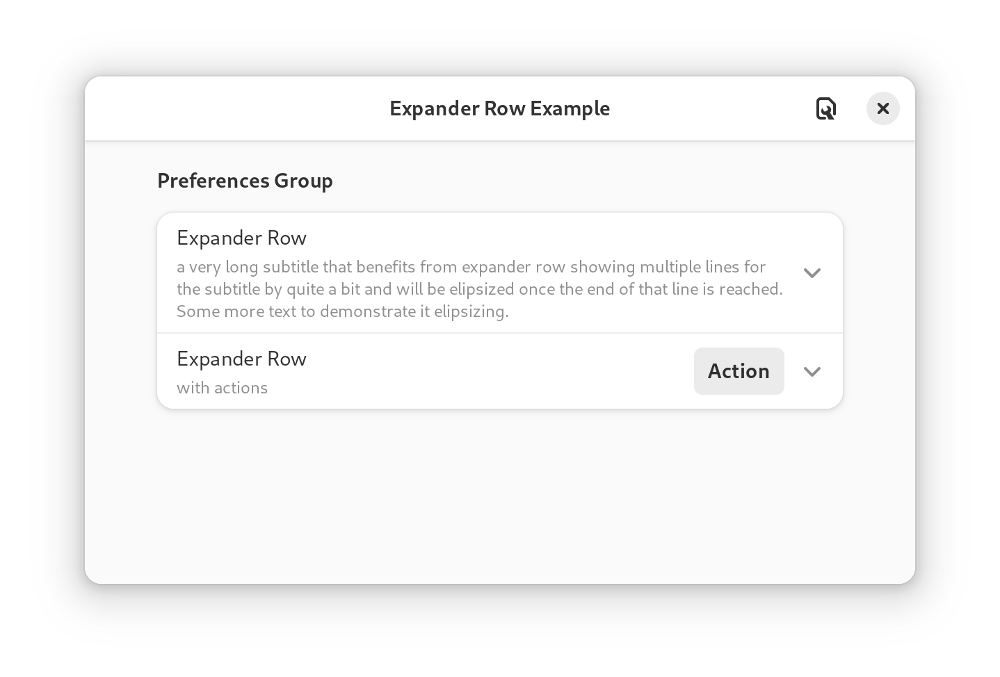

# Owlkettle Examples

<table>
  <tr>
    <th>Name</th>
    <th>Image</th>
  </tr>
  <tr>
    <td><a href="https://github.com/can-lehmann/owlkettle/blob/main/examples/counter.nim">Counter</a></td>
    <td></td>
  </tr>
</table>

## Applications

The `apps` directory contains full application examples.

<table>
  <tr>
    <th>Name</th>
    <th>Image</th>
  </tr>
  <tr>
    <td><a href="https://github.com/can-lehmann/owlkettle/blob/main/examples/apps/app_launcher.nim">App Launcher</a></td>
    <td>
      No Image
      <!--
      
      -->
    </td>
  </tr>
  <tr>
    <td><a href="https://github.com/can-lehmann/owlkettle/blob/main/examples/apps/temp_converter.nim">Temperature Converter</a></td>
    <td></td>
  </tr>
  <tr>
    <td><a href="https://github.com/can-lehmann/owlkettle/blob/main/examples/apps/todo.nim">Todo</a></td>
    <td></td>
  </tr>
</table>

## Dialogs

The `dialogs` directory contains examples of how to use the different built-in dialogs.

<table>
  <tr>
    <th>Name</th>
    <th>Image</th>
  </tr>
  <tr>
    <td><a href="https://github.com/can-lehmann/owlkettle/blob/main/examples/dialogs/about_dialog.nim">About Dialog</a></td>
    <td>
      No Image
      <!--
      
      -->
    </td>
  </tr>
  <tr>
    <td><a href="https://github.com/can-lehmann/owlkettle/blob/main/examples/dialogs/custom_dialog.nim">Custom Dialog</a></td>
    <td></td>
  </tr>
  <tr>
    <td><a href="https://github.com/can-lehmann/owlkettle/blob/main/examples/dialogs/dialog_respond.nim">Dialog Respond</a></td>
    <td></td>
  </tr>
  <tr>
    <td><a href="https://github.com/can-lehmann/owlkettle/blob/main/examples/dialogs/file_dialog.nim">File Dialog</a></td>
    <td></td>
  </tr>
  <tr>
    <td><a href="https://github.com/can-lehmann/owlkettle/blob/main/examples/dialogs/message_dialog.nim">Message Dialog</a></td>
    <td></td>
  </tr>
</table>

## Miscellaneous

The `misc` directory contains miscellaneous examples.

<table>
  <tr>
    <th>Name</th>
    <th>Image</th>
  </tr>
  <tr>
    <td><a href="https://github.com/can-lehmann/owlkettle/blob/main/examples/misc/cairo_path.nim">Cairo Path</a></td>
    <td></td>
  </tr>
  <tr>
    <td><a href="https://github.com/can-lehmann/owlkettle/blob/main/examples/misc/clipboard.nim">Clipboard</a></td>
    <td></td>
  </tr>
  <tr>
    <td><a href="https://github.com/can-lehmann/owlkettle/blob/main/examples/misc/css.nim">CSS</a></td>
    <td></td>
  </tr>
  <tr>
    <td><a href="https://github.com/can-lehmann/owlkettle/blob/main/examples/misc/notification.nim">Notification</a></td>
    <td>
      
      
    </td>
  </tr>
  <tr>
    <td><a href="https://github.com/can-lehmann/owlkettle/blob/main/examples/misc/threading.nim">Threading</a></td>
    <td>No Image</td>
  </tr>
  <tr>
    <td><a href="https://github.com/can-lehmann/owlkettle/blob/main/examples/misc/timeout_event.nim">Timeout Event</a></td>
    <td>No Image</td>
  </tr>
</table>

## Widgets

The `widgets` directory contains examples for how to use different widgets.

<table>
  <tr>
    <th>Name</th>
    <th>Image</th>
  </tr>
  <tr>
    <td><a href="https://github.com/can-lehmann/owlkettle/blob/main/examples/widgets/calendar.nim">Calendar</a></td>
    <td></td>
  </tr>
  <tr>
    <td><a href="https://github.com/can-lehmann/owlkettle/blob/main/examples/widgets/context_menu.nim">Context Menu</a></td>
    <td></td>
  </tr>
  <tr>
    <td><a href="https://github.com/can-lehmann/owlkettle/blob/main/examples/widgets/drawing_area.nim">Drawing Area</a></td>
    <td></td>
  </tr>
  <tr>
    <td><a href="https://github.com/can-lehmann/owlkettle/blob/main/examples/widgets/drop_down.nim">Drop Down</a></td>
    <td></td>
  </tr>
  <tr>
    <td><a href="https://github.com/can-lehmann/owlkettle/blob/main/examples/widgets/fixed.nim">Fixed</a></td>
    <td></td>
  </tr>
  <tr>
    <td><a href="https://github.com/can-lehmann/owlkettle/blob/main/examples/widgets/grid.nim">Grid</a></td>
    <td></td>
  </tr>
  <tr>
    <td><a href="https://github.com/can-lehmann/owlkettle/blob/main/examples/widgets/picture.nim">Picture</a></td>
    <td></td>
  </tr>
  <tr>
    <td><a href="https://github.com/can-lehmann/owlkettle/blob/main/examples/widgets/popover_menu.nim">Popover Menu</a></td>
    <td></td>
  </tr>
  <tr>
    <td><a href="https://github.com/can-lehmann/owlkettle/blob/main/examples/widgets/radio_group.nim">Radio Group</a></td>
    <td></td>
  </tr>
  <tr>
    <td><a href="https://github.com/can-lehmann/owlkettle/blob/main/examples/widgets/scale.nim">Scale</a></td>
    <td></td>
  </tr>
  <tr>
    <td><a href="https://github.com/can-lehmann/owlkettle/blob/main/examples/widgets/text_view.nim">Text View</a></td>
    <td></td>
  </tr>
</table>

### adwaita

<table>
  <tr>
    <th>Name</th>
    <th>Image</th>
  </tr>
  <tr>
    <td><a href="https://github.com/can-lehmann/owlkettle/blob/main/examples/widgets/adw/combo_row.nim">Combo Row</a></td>
    <td></td>
  </tr>
  <tr>
    <td><a href="https://github.com/can-lehmann/owlkettle/blob/main/examples/widgets/adw/expander_row.nim">Expander Row</a></td>
    <td></td>
  </tr>
  <tr>
    <td><a href="https://github.com/can-lehmann/owlkettle/blob/main/examples/widgets/adw/flap.nim">Flap</a></td>
    <td></td>
  </tr>
  <tr>
    <td><a href="https://github.com/can-lehmann/owlkettle/blob/main/examples/widgets/adw/preferences_group.nim">Preferences Group</a></td>
    <td></td>
  </tr>
  <tr>
    <td><a href="https://github.com/can-lehmann/owlkettle/blob/main/examples/widgets/adw/window_title.nim">Window Title</a></td>
    <td></td>
  </tr>
</table>

